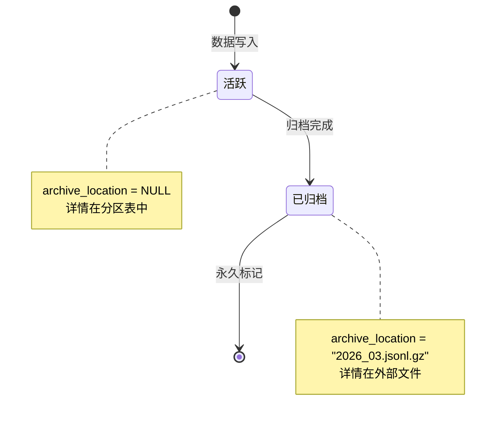
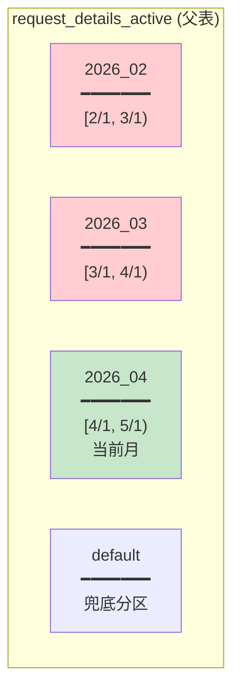
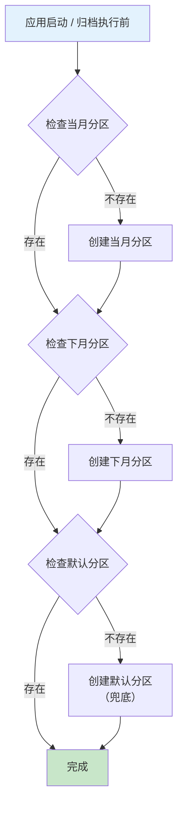
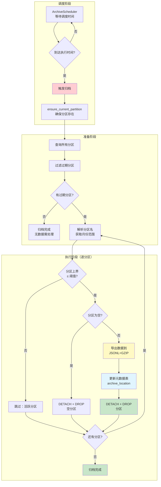
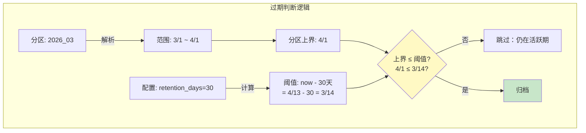
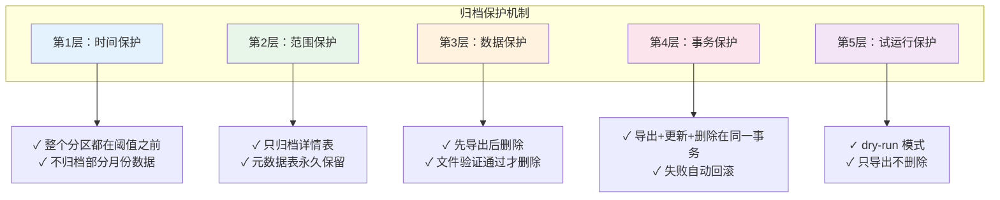
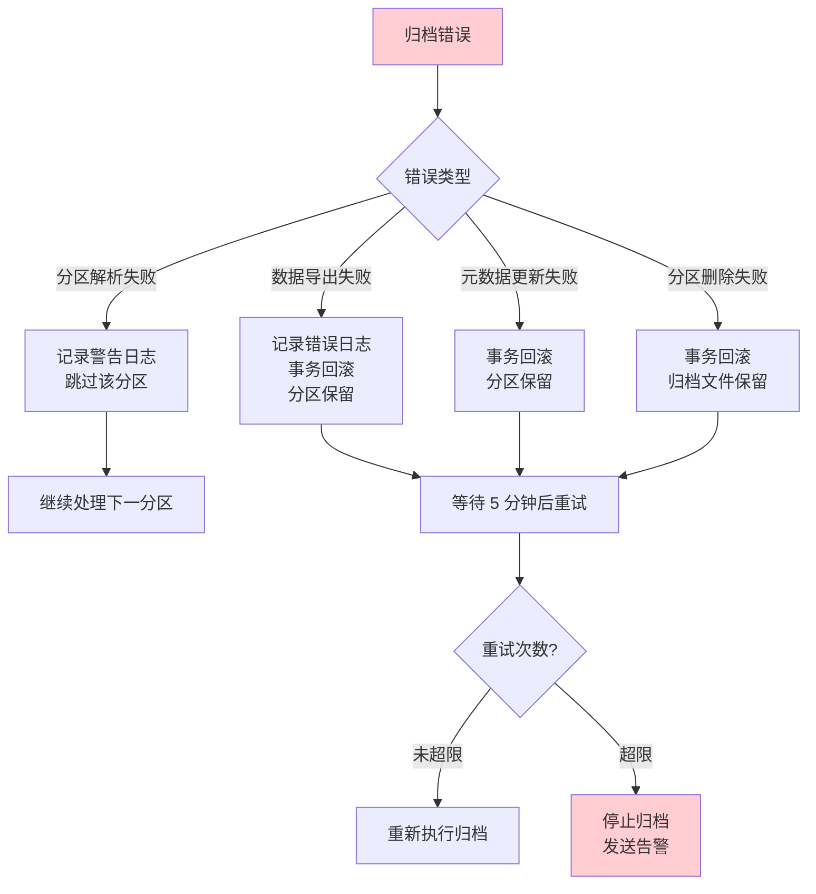
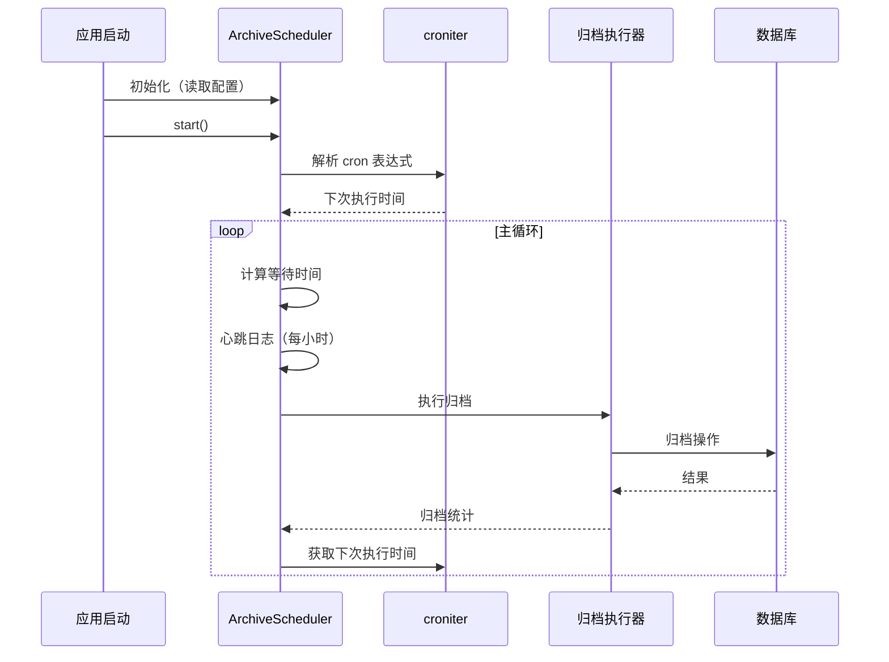

# 数据库归档机制设计文档

> **导航**: [文档中心](../README.md) | [数据库设计](database.md)

---

## 1. 核心设计理念

### 1.1 问题背景

请求轨迹数据的典型特征：

| 数据类型 | 增长速度 | 访问频率 | 存储占比 |
|----------|----------|----------|----------|
| 统计元数据 | 慢 | 高 | ~5% |
| 详情大字段 | 快 | 低 | ~95% |

**核心矛盾**：详情大字段增长快、访问少，却占据了绝大部分存储空间。

### 1.2 设计目标

```
┌─────────────────────────────────────────────────────────────┐
│                      设计目标金字塔                           │
├─────────────────────────────────────────────────────────────┤
│                                                             │
│                       ┌─────────┐                           │
│                       │ 零运维  │ ← 应用内调度，无外部依赖     │
│                       └────┬────┘                           │
│                    ┌───────┴───────┐                        │
│                    │   零 VACUUM   │ ← 分区删除，空间立回收   │
│                    └───────┬───────┘                        │
│              ┌─────────────┴─────────────┐                  │
│              │  统计能力不受影响（元数据） │                  │
│              └─────────────┬─────────────┘                  │
│        ┌───────────────────┴───────────────────┐            │
│        │  详情数据可归档可恢复（JSONL+GZIP）    │            │
│        └───────────────────────────────────────┘            │
│                                                             │
└─────────────────────────────────────────────────────────────┘
```

---

## 2. 整体架构

### 2.1 数据分层架构

```mermaid
graph TB
    subgraph 写入层["写入层"]
        ctx[ProcessContext] --> repo[RequestRepository.insert]
        repo --> |双写事务| meta & detail
    end

    subgraph 存储层["存储层"]
        meta[request_metadata<br/>元数据表<br/>━━━━━━━━━━━<br/>长期保留<br/>含统计信息] 
        detail[request_details_active<br/>详情分区表<br/>━━━━━━━━━━━<br/>按月分区<br/>仅存近期]
        
        meta --> |"archive_location = NULL"| detail
        meta -.-> |"archive_location = 文件名"| archive_file
    end

    subgraph 归档层["归档层"]
        scheduler[ArchiveScheduler<br/>定时调度器] --> |触发| archiver[归档执行器]
        archiver --> |导出| archive_file[/data/archives/<br/>YYYY_MM.jsonl.gz]
        archiver --> |更新| meta
        archiver --> |删除| detail
    end

    subgraph 查询层["查询层"]
        query_active[活跃数据查询] --> |JOIN| meta & detail
        query_archived[已归档查询] --> |仅查| meta
        query_archived -.-> |读文件| archive_file
    end

    style meta fill:#e1f5fe
    style detail fill:#fff3e0
    style archive_file fill:#e8f5e9
    style scheduler fill:#fce4ec
```

### 2.2 表职责划分

| 表名 | 职责 | 生命周期 | 关键字段 |
|------|------|----------|----------|
| `request_metadata` | 存储统计信息，关联查询入口 | **永久保留** | `archive_location` |
| `request_details_active` | 存储详情大字段 | **按月分区，过期归档** | `created_at`（分区键） |

**关键字段 `archive_location` 状态转移**：



---

## 3. 分区管理机制

### 3.1 分区结构



**分区命名规范**：`request_details_active_YYYY_MM`

### 3.2 分区自动创建



**触发时机**：
- 容器启动时（`entrypoint.sh`）
- 每次归档执行前（`ensure_current_partition`）

---

## 4. 归档流程

### 4.1 完整归档流程



### 4.2 归档条件判断（关键逻辑）



**判断公式**：
```
partition_end_date ≤ (now - retention_days) → 可归档
```

---

## 5. 保护机制

### 5.1 多层保护体系



### 5.2 保护机制详解

#### 第1层：时间保护

```python
# 只有整个分区都在阈值之前才归档
threshold = datetime.now() - timedelta(days=retention_days)
month_end = parse_partition_end(partition_name)

if month_end > threshold:
    # 分区仍在活跃期，跳过
    continue
```

**保护效果**：避免部分归档导致的数据割裂

#### 第2层：范围保护

```python
# 元数据表永不删除，只更新 archive_location 字段
UPDATE request_metadata
SET archive_location = '2026_03.jsonl.gz',
    archived_at = NOW()
WHERE unique_id IN (...)
```

**保护效果**：统计查询能力永久保留

#### 第3层：数据保护

```python
# 先导出验证，后删除分区
records = await cur.fetchall()  # 导出数据
write_gzip_file(records)        # 写入文件
verify_file()                   # 验证文件
# 验证通过后才执行删除
await detach_and_drop_partition()
```

**保护效果**：数据先安全导出，再删除分区

#### 第4层：事务保护

```python
async with conn.transaction():
    # 1. 更新元数据
    await conn.execute("UPDATE request_metadata SET archive_location = ...")
    # 2. 删除分区
    await conn.execute("ALTER TABLE ... DETACH PARTITION ...")
    await conn.execute("DROP TABLE ...")
    # 任一步骤失败，整体回滚
```

**保护效果**：原子性操作，一致性保证

#### 第5层：试运行保护

```bash
# --dry-run 模式
python scripts/archive_records.py --dry-run --retention-days 30
```

**保护效果**：
- ✓ 导出数据到文件
- ✗ 不更新 archive_location
- ✗ 不删除分区

### 5.3 错误处理流程



---

## 6. 调度器设计

### 6.1 调度架构



### 6.2 配置项

```yaml
archive:
  enabled: false                  # 启用开关
  retention_days: 30              # 保留天数
  storage_path: "/data/archives" # 存储路径
  schedule: "0 2 * * *"           # 每天凌晨2点
  timezone: "Asia/Shanghai"       # 时区
```

### 6.3 状态监控

```python
def get_status() -> Dict:
    return {
        "running": True,
        "schedule": "0 2 * * *",
        "last_run": "2026-04-13T02:00:00",
        "total_runs": 15,
        "total_records_archived": 12345,
        "last_result": {...}
    }
```

---

## 7. 归档文件格式

### 7.1 文件结构

```
/data/archives/
├── 2026_01.jsonl.gz    # 1月归档
├── 2026_02.jsonl.gz    # 2月归档
└── 2026_03.jsonl.gz    # 3月归档
```

### 7.2 数据格式

```jsonl
{"unique_id": "sess_001,req_001", "messages": [...], "created_at": "2026-03-15T10:30:00", ...}
{"unique_id": "sess_001,req_002", "messages": [...], "created_at": "2026-03-15T10:31:00", ...}
```

**格式优势**：
- JSONL：每行独立 JSON，支持流式读取
- GZIP：压缩率 ~10:1，节省存储空间

---

## 8. 运维指南

### 8.1 启用归档

```yaml
# config.yaml
archive:
  enabled: true
  retention_days: 30
  schedule: "0 2 * * *"
  timezone: "Asia/Shanghai"
```

### 8.2 手动归档

```bash
# 正常归档
python scripts/archive_records.py --retention-days 30

# 试运行（推荐先执行）
python scripts/archive_records.py --dry-run --retention-days 30
```

### 8.3 监控指标

| 指标 | 检查方法 | 告警阈值 |
|------|----------|----------|
| 调度器状态 | 日志含 "ArchiveScheduler 已启动" | 未启动 |
| 归档执行 | 日志含 "归档任务完成" | 连续失败 3 次 |
| 磁盘空间 | `df /data/archives` | 使用率 > 80% |
| 分区数量 | SQL 查询 pg_class | > 24 个分区 |

### 8.4 常见问题

| 问题 | 原因 | 解决方案 |
|------|------|----------|
| 归档未执行 | `enabled: false` | 修改配置并重启 |
| 分区未删除 | 分区仍在活跃期 | 确认 retention_days 设置 |
| 磁盘空间不足 | 归档文件过多 | 扩容或迁移历史文件 |
| 查询报错 | JOIN 到已归档数据 | 检查 `archive_location IS NULL` 条件 |

---

## 9. 关键文件索引

| 文件 | 职责 |
|------|------|
| `traj_proxy/archive/scheduler.py` | 调度器实现 |
| `traj_proxy/archive/archiver.py` | 执行器实现 |
| `scripts/archive_records.py` | 独立归档脚本 |
| `traj_proxy/utils/config.py` | 配置加载 |
| `tests/e2e/layers/archive/` | E2E 测试用例 |
